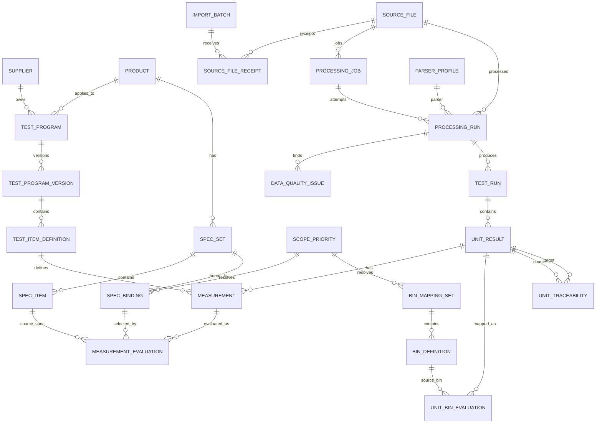

# TMS CP/FT 标准数据模型与 ERD（v0.6）

> 数据库：Microsoft SQL Server 2014 SP3+，Compatibility Level 120
> v0.6 保留 v0.4 Canonical Fact，并增加 **IAM、Input Set、Dataset Version、Rule Version、Evaluation Run、Export** 六类应用闭环实体。

## 1. v0.4 设计原则

1. **原始测试事实与业务判断分离**。
2. **Parser 执行结果不可覆盖历史版本**。
3. **Spec/Bin 必须可解释“为什么命中这一条规则”**。
4. **重复上传不等于重复入库**。
5. **Retest 全保留，同时能明确计算 First Pass Yield 与 Final Yield**。
6. **所有系统时间为 UTC；源本地时间保留解析证据**。
7. **只有 current + published processing run 进入默认业务查询视图**。
8. **Schema 只通过 migration 变化**。

## 2. v0.4 Canonical + Governance Model

```text
SOURCE_FILE ── SOURCE_FILE_RECEIPT
     │
     ▼
PROCESSING_JOB
     │
     ▼
PROCESSING_RUN ───────── DATA_QUALITY_ISSUE
     │
     ├────────────── TEST_RUN
     │                    │
     │                    ▼
     │                UNIT_RESULT
     │                    │
     │                    ▼
     │                MEASUREMENT
     │                    │
     │                    ▼
     │          MEASUREMENT_EVALUATION
     │                    │
     │              SPEC_BINDING
     │                    │
     │                 SPEC_ITEM
     │
     └──────── UNIT_BIN_EVALUATION
                      │
                 BIN_MAPPING_SET
                      │
                 BIN_DEFINITION
```

## 3. Schema 分层

```text
mdm
  supplier
  product / product_alias
  test_program / test_program_version
  test_item_definition
  scope_priority
  spec_set / spec_item / spec_binding
  bin_mapping_set / bin_definition

ingestion
  import_batch
  source_file
  source_file_receipt
  parser_profile
  processing_job
  processing_run
  data_quality_rule
  data_quality_issue

test
  test_run
  unit_result
  measurement
  measurement_evaluation
  unit_bin_evaluation

trace
  unit_traceability

governance
  audit_log

analytics
  current published views
  yield / cpk / pat / spc summaries（可重算）
```

## 4. ERD



## 5. Measurement：只保存事实

`test.measurement` 保存：

```text
unit_id
test_item_id
value_numeric
value_text
raw_value
measurement_status
tester_pass_flag
source_column_index
```

### v0.4 删除/禁止的语义

`measurement.is_in_spec` 不再作为 Canonical Fact。

原因：同一个值可能同时被多套规则评价：

```text
VTH = 6.30 V
├─ Datasheet Spec 2025  → PASS
├─ Automotive Spec 2026 → FAIL
├─ Customer A Spec      → FAIL
└─ PAT 5σ               → FAIL
```

因此业务判断进入 `measurement_evaluation`。

## 6. Measurement Evaluation

粒度：

```text
Measurement + Evaluation Context + Evaluation Run
```

关键字段：

```text
evaluation_type      SPEC / PAT / SBL / SAFE_LAUNCH / OTHER
evaluation_scope_key DEFAULT / CUSTOMER:A / PAT:BASELINE_001
spec_binding_id
spec_item_id
lsl_applied
usl_applied
lower_operator_applied
upper_operator_applied
evaluation_result    PASS / FAIL / NOT_EVALUATED / CONFIG_ERROR
evaluation_reason
processing_run_id
is_current
```

**必须保存实际应用的限制值**，不能只保存 `spec_item_id`，因为未来规则本身可能被废止或迁移。

## 7. Spec Binding 与匹配

`spec_set/spec_item` 表示“规格是什么”；`spec_binding` 表示“什么时候、对谁使用这套规格”。

Binding 可以限定：

```text
supplier
product
test_stage
program_version
customer
quality_grade
package
effective_from / effective_to
```

系统先找所有匹配 Binding，再按 `scope_priority.priority` 取最高等级。

### 冻结规则

- 最高优先级只有 1 条 → 命中。
- 最高优先级 0 条 → `NO_MATCH`，是否 fallback 到 Tester Program Limit 由 evaluation context 决定。
- 最高优先级 >1 条 → `CONFIG_AMBIGUOUS`，**不得按 ID、创建时间等偷偷选一条**。

## 8. Bin Mapping

`unit_result.soft_bin/hard_bin` 保存**厂商原始 Bin Code**。

Bin 的业务含义由：

```text
bin_mapping_set
  └─ bin_definition
```

解释，并写入 `unit_bin_evaluation`：

```text
raw_bin_code
bin_mapping_set_id
bin_definition_id
mapping_status
failure_mode
is_pass
```

这样历史数据不会因为后续 Bin 定义修改而失去解释依据。

## 9. Processing Run 与 Parser 重跑

一份 `source_file` 可以有多个 Processing Run：

```text
source_file A
├─ Run #1 / Parser 1.0 / SUPERSEDED
├─ Run #2 / Parser 1.1 / FAILED
└─ Run #3 / Parser 1.2 / PUBLISHED / CURRENT
```

新 Parser 重跑：

1. 新建 processing job/run。
2. 写入新的 canonical rows。
3. 执行 Data Quality Gate。
4. 成功后在一个事务内把旧 current run 置为 SUPERSEDED，把新 run 置为 CURRENT。
5. 不 UPDATE 旧 measurement 事实。

## 10. 重复上传模型

`source_file` = 内容身份，SHA256 唯一。  
`source_file_receipt` = 每次用户/接口实际上传事件。

因此同一个文件上传 3 次：

```text
1 source_file
3 source_file_receipt
0 或 1 次默认解析
```

强制重跑也不创建第二份 source file，只创建新的 processing run。

## 11. Retest

### Test Run Retest

`test_run.run_attempt_no`：整个 Wafer/Lot Session 的运行尝试。

### Unit Retest

`unit_result.logical_unit_key + attempt_no`：同一物理/逻辑单元的多次测试。

CP `logical_unit_key` 推荐：

```text
CP|product|lot|wafer|x|y
```

FT 有稳定 Serial 时：

```text
FT|product|lot|serial
```

无稳定 Serial 时可以暂以 vendor unit id / sequence 构造，但必须记录 Data Quality Warning。

**全部 attempt 保存。**

- FPY：每个 logical unit 的 `MIN(attempt_no)`。
- Final Yield：每个 logical unit 的 `MAX(attempt_no)` 或业务明确的 final attempt。

禁止在 ETL 时只保留最后 PASS。

## 12. 时区模型

所有系统生成时间：

```text
*_utc datetime2(3)
DEFAULT SYSUTCDATETIME()
```

测试源时间同时保存：

```text
source_started_local
source_timezone_iana
source_utc_offset_minutes
timezone_resolution
```

`timezone_resolution`：

```text
SOURCE_EXPLICIT
SUPPLIER_DEFAULT
FILE_RULE
UNKNOWN
```

如果源文件无时区：

1. 优先 Supplier 默认时区。
2. 其次 Parser 格式规则。
3. 无法确定则 `UNKNOWN` + DQ Warning。
4. **禁止直接采用应用服务器/SQL Server 本地时区。**

## 13. 默认业务查询边界

默认 API / analytics view 必须过滤：

```text
processing_run.status = PUBLISHED
AND processing_run.is_current = 1
```

历史/审计页面才允许查看 superseded run。

## 14. v0.6 应用闭环扩展

```text
IAM.USER ── USER_ROLE ── ROLE ── ROLE_PERMISSION ── PERMISSION
   │                          │
   └────────────── DATA_SCOPE_GRANT

IMPORT_BATCH ── IMPORT_BATCH_FILE ── SOURCE_FILE_RECEIPT ── SOURCE_FILE
      │
      ▼
PROCESSING_JOB ── PROCESSING_RUN ── TEST_RUN ── UNIT ── MEASUREMENT
      │                 │
      │                 └── DQ_ISSUE ── DQ_RULE_VERSION ── DQ_RULE_SET
      ▼
DATASET ── DATASET_VERSION ── DATASET_VERSION_RUN
                    │
                    ├── EVALUATION_RUN ── EVALUATION_RULE_VERSION
                    │          ├── MEASUREMENT_EVALUATION
                    │          └── METRIC_RESULT
                    │
                    ├── SAVED_ANALYSIS
                    └── EXPORT_JOB ── EXPORT_ARTIFACT
```

### 14.1 Input Set

`ingestion.import_batch` 表示一次用户选择的输入集合；`import_batch_file` 固化 Receipt、文件角色和顺序。允许角色包括 `DETAIL/YIELD/SPEC/PAT/EXPORT/REPORT/MANIFEST/OTHER`。Processing Job 必须关联一个 Input Set，单文件输入也是只有一条成员的 Input Set。

### 14.2 Dataset Version

`dataset.dataset` 是稳定业务身份，`dataset.dataset_version` 是不可静默覆盖的发布版本。Dataset Version 可以关联一个或多个 Processing Run，解决多文件、多 Parser 子任务以及 FT DC/DVDS/RG 共同形成一个逻辑数据集的问题。

只有 `status='PUBLISHED' AND is_current=1` 的 Dataset Version 进入默认业务查询。历史分析与导出始终指向明确版本，不随 current 切换漂移。

### 14.3 Evaluation Run

`evaluation.evaluation_run` 固化 Dataset Version、Rule Version、evaluation type/context、normalized filter JSON + hash、算法参数、样本数、排除数量和执行状态。

Spec/PAT/SBL/CPK/SPC 的每个结果必须关联 Evaluation Run。`processing_run_id` 只回答“事实由哪次清洗产生”，不能代替评价运行。

### 14.4 Export 与 Saved Analysis

`delivery.export_job` 固化数据版本、筛选、评价上下文和导出模板版本；`export_artifact` 保存 URI、SHA、大小、过期时间和下载审计。`analysis.saved_analysis` 保存 Dataset Version 与图表配置，不把无来源数据复制到浏览器 Local Storage 作为正式记录。

## 15. v0.6 唯一性与发布约束

1. 一个 Input Set 中 `(receipt_id, file_role, ordinal_no)` 不重复。
2. 一个 Dataset 最多一个 current + published Dataset Version。
3. 一个 Evaluation Run 的 `filter_hash + rule_version + dataset_version` 可用于幂等缓存，但重新发布规则必须形成新 Rule Version。
4. DQ BLOCKER 不允许 WAIVED/IGNORED；ERROR 是否可 Waive 由 DQ Rule Version 决定。
5. Parser、Cleaner、DQ、Spec/Bin、PAT/SBL/CPK/SPC 的版本身份必须分别可追溯。
6. 默认 Analytics View 通过 Dataset Version 过滤，不能仅依赖单个 Source File 的 current Processing Run。
