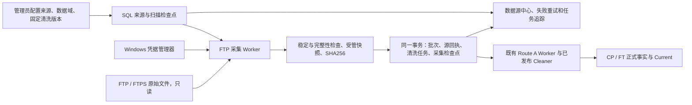

# NCE PYMS FTP 服务器对接设计

日期：2026-09-05。用户本轮明确启动 FTP 服务器对接，替代此前“FTP 自动采集暂缓”的执行范围；SAP、异常工单及 AI 的延期决定不变。

## 1. 目标与边界

FTP 原始文件继续由现有服务器保存。TMS 配置受控来源，以只读账号读取文件，在服务器附近建立完整快照，交给已有 CP/FT Cleaner 和 Route A Worker 正式入库。阶段、厂家、输入类型、数据域和 Cleaner Release 都由数据源配置固定，不猜测格式或业务身份，不增加工程/量产目录要求。

第一版支持 FTP 与显式 TLS 的 FTPS、被动数据连接、UTF-8/GB18030 文件名、MLSD 标准清单。SFTP 属于不同协议，本版不把它作为 FTP 的别名。不支持 MLSD 或缺少可靠大小/修改时间的服务器会给出明确错误；实际厂家目录合同确认后再增加专用适配，不解析未知 LIST 文本。

## 2. 数据流与职责

- API 管理来源、启停、立即扫描请求和记录查询；扫描与下载由独立 Worker 执行。
- 新建来源默认暂停。启用后，Worker 按配置周期领取来源；“立即采集”只提前调度，不绕过稳定性和完整性检查。
- Windows 一键启动增加第五个进程：FTP 采集 Worker。五项均就绪且数据库身份一致后才判定全部就绪。没有启用来源时采集 Worker 保持空闲。
- 生产任务配置增加 `TMS-FtpCollectionWorker`；开机运行、失败重启和禁止重复实例沿用已有部署合同。当前实现不等于已在目标服务器注册或完成长期运行验收。

## 3. 输入合同与去重

| 配置 | 明确规则 |
|---|---|
| SINGLE_FILE | 一个文件/归档包对应一个采集包；华虹散落 DCP 文本不能按单文件提交 |
| DIRECTORY | 指定根目录下第 1–4 层为批次目录，包含其允许类型的源文件；必须有数据提供方确认的完成标记 |
| 稳定窗口 | 文件与标记修改时间足够早，且至少两次扫描清单一致、两次观察间隔达到稳定窗口后才下载 |
| 传输确认 | 流式写入，核对实际字节数并计算 SHA256；下载后重新扫描该采集包，清单和完成标记必须保持一致 |
| 扫描去重 | `(source_definition_id, package_key)` 唯一；同一来源、同一路径重复扫描复用检查点，不创建新的批次和任务 |
| 内容追溯 | 保存每个文件 SHA256 与完整包内容摘要；源文件台账继续复用既有全局 SHA 登记逻辑 |
| 已提交路径变化 | 标记 CHANGED，保留原任务与历史 Dataset，不自动重算。修订原始数据需采用新的受控版本路径及明确业务流程 |
| 不同来源/路径 | 不以“相同字节”自动合并业务身份；路径可能参与 Lot 身份，必须保留来源和批次语义 |

MLSD 的路径、大小和修改时间用于扫描检查点，不是远端内容签名。若服务器在同大小、同修改时间下替换内容，元数据扫描不能证明未变。因此数据提供方应保证完成后路径不可变；本地 SHA 证明本次实际收到的内容。下载中断按文件重新下载，恢复的是扫描/任务检查点，第一版不宣称字节级断点续传。

保留批次目录叶子名称及包内相对结构，继续满足既有 CP Cleaner 的目录身份合同。默认限制扫描条目、层级、文件数、字节数和每次提交包数；名称跳转、Windows 名称碰撞、链接及未知条目拒绝进入受管快照。下载前保留至少 1 GiB 空闲空间。

## 4. 数据库与事务

`sql2014_0029` 为增量迁移，不修改已有测量或 Dataset。沿用 `ingestion.source_definition`，新增：

- `ingestion.ftp_collection_state`：固定配置、下一次调度、租约、最近状态及失败信息。
- `ingestion.ftp_collection_run`：每次扫描执行记录、发现/提交数量、完成或中断状态。
- `ingestion.ftp_package`：路径检查点、观察指纹、稳定时间、重试次数、内容 SHA、正式批次及清洗任务关联。

下载和 SHA 计算在数据库事务外执行。提交时重新锁定来源、租约、有效数据域和已发布 Cleaner；在一个 SQL 事务内登记正式批次、源回执、INITIAL_IMPORT 任务及采集检查点。事务失败不留下“批次登记成功、任务未登记”的半完成状态。唯一约束与检查点共同阻止重领导致的重复任务。

租约 120 秒，每 20 秒续租；暂停、失租或租约过期的 Worker 不能提交新任务。崩溃后下一 Worker 将旧扫描标为 INTERRUPTED 并从已提交检查点继续。停止进程时完成当前包后停止接新包；超时保留进程及状态，不强杀正在提交的操作。

文件采集失败最多自动尝试 3 次，之后由管理员重试；扫描失败延后调度。已提交清洗任务失败时从原任务处理，不重新下载并新建重复 Dataset。提交响应丢失时保留本次快照，下一次扫描以原子检查点核实结果；未登记快照可能需要运行人员对账后清理，第一版不自动删除无法证明未被引用的文件。

已有采集配置/历史时禁止自动降级此迁移，避免丢失来源追溯。配置定义保持固定；调整根目录、厂家或输入合同使用新的来源编码，凭据内容可在本机按原引用轮换。

## 5. 凭据与权限

- SQL 和 API 只保存 `credential_ref`。密码通过 Windows `Get-Credential` 录入，使用本地进程标准输入送入凭据管理器，不进入命令行参数、Git、数据库、报告或运行日志。
- API 与采集 Worker 必须在能读取同一凭据的 Windows 账号下运行；单独部署时分别配置同名凭据。
- `SOURCE_ADMIN` 负责创建、启停、连接检查和扫描调度。此权限本身不会授予源文件或正式结果读取权。
- 普通用户只能查看授权数据域的来源及采集记录；开发期全数据管理员继续遵守 9 月 2 日现行口径。清洗任务和正式 Dataset 沿用已有权限查询。
- 正式数据归属为 DOMAIN，技术 Owner 为不可登录的 SYSTEM_INGESTION；配置人、调度人不会因此成为数据 Owner。工程/量产暂用既有技术占位值，不能当作来自 FTP 的真实业务判定。
- FTPS 使用证书及主机名校验，并保护数据通道；不会退回 FTP 或关闭证书验证。服务端原始文件不发送删除、移动、改名和上传命令。

## 6. 配置与联调步骤

1. 确认实际协议、地址、端口、根目录、文件名编码、阶段/厂家、批次目录层级或单文件合同；目录方式同时确认完成标记和写入顺序。
2. 确认目标数据域、现有正式 Cleaner Release 和预计文件数/容量，取得只读 FTP 账号。
3. 在 API/采集 Worker 运行账号下执行 `scripts/windows/set_tms_ftp_credential.ps1 -Reference <引用>`，通过交互窗口录入账号密码。发布包部署须同时指定 `-PythonPath <包外Python路径>`；中文账号和密码通过 UTF-8 标准输入传递。
4. 管理员在“数据源中心→FTP 自动采集”新增来源，检查连接、根目录和 MLSD；来源保持暂停直到准备就绪。
5. 启用来源或立即采集。核对采集记录、清洗任务、来源 SHA、Lot/参数/良率及 Current；重复扫描不得新增相同来源路径的入库任务。
6. 验证文件上传中、完成标记缺失、连接中断、暂停、重启、重复文件和已提交路径变化；最后执行目标环境业务验收。

截至设计编写时，实际 FTP 地址、协议与批次目录合同尚未由用户提供。本轮先完成通用实现及本地协议/开发库验证，实际厂家服务器连通性、目录合同和生产调度另列结果，不用模拟服务器代替企业服务器验收。

## 7. 协议与平台依据

- [Python ftplib 官方文档](https://docs.python.org/3.12/library/ftplib.html)：FTP/FTP_TLS、MLSD、被动模式与数据通道保护。
- [Windows CredReadW 官方文档](https://learn.microsoft.com/en-us/windows/win32/api/wincred/nf-wincred-credreadw)：当前登录会话账号的凭据读取。

实现与测试结果见 [同日期完成报告](../development/NCE_PYMS_FTP_Integration_Completion_Report_2026-09-05.md)；历史 FTP 延期说明保留为决策记录，本设计为本轮增量执行依据。
